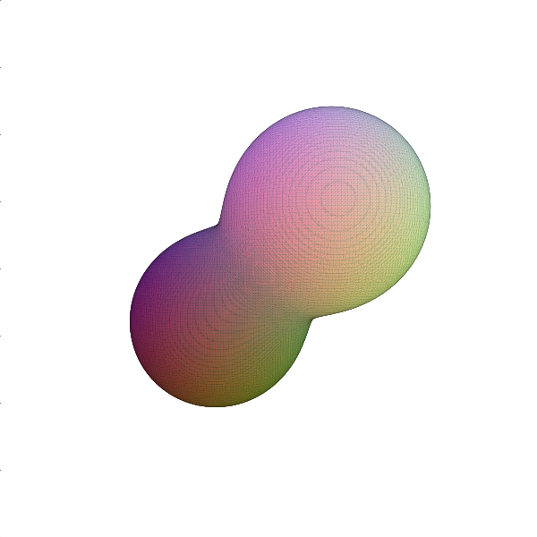

torchmcubes: marching cubes for PyTorch
===

[](https://github.com/tatsy/torchmcubes/actions/workflows/build.yml)

> Marching cubes for PyTorch environment. Backend is implemented with C++ and CUDA.

## Install

### Requirements

- Python (3.9 or later)
- NumPy (1.x is preferable)
- PyTorch

### Pip installation

```shell
# Make sure that your environment meets the requirements above
pip install git+https://github.com/tatsy/torchmcubes.git
```

## Usage

See [mcubes.py](./mcubes.py) for more details.

```python
import time
import numpy as np

import torch
from torchmcubes import marching_cubes, grid_interp

# Grid data
N = 128
xs = np.linspace(-1.0, 1.0, N, endpoint=True, dtype="float32")
ys = np.linspace(-1.0, 1.0, N, endpoint=True, dtype="float32")
zs = np.linspace(-1.0, 1.0, N, endpoint=True, dtype="float32")
zs, ys, xs = np.meshgrid(zs, ys, xs)

# Implicit function (metaball)
f0 = (xs - 0.35)**2 + (ys - 0.35)**2 + (zs - 0.35)**2
f1 = (xs + 0.35)**2 + (ys + 0.35)**2 + (zs + 0.35)**2
u = 4.0 / (f0 + 1.0e-6) + 4.0 / (f1 + 1.0e-6)

rgb = np.stack((xs, ys, zs), axis=-1) * 0.5 + 0.5
rgb = np.transpose(rgb, axes=(3, 2, 1, 0))
rgb = np.ascontiguousarray(rgb)

# Test
u = torch.from_numpy(u)
rgb = torch.from_numpy(rgb)
u = u.cuda()
rgb = rgb.cuda()

t_start = time.time()
verts, faces = marching_cubes(u, 15.0)
colors = grid_interp(rgb, verts)
t_end = time.time()
print(f"verts: {verts.size(0)}, faces: {faces.size(0)}, time: {t_end - t_start:.2f}s")

verts = verts.detach().cpu().numpy()
faces = faces.detach().cpu().numpy()
colors = colors.detach().cpu().numpy()
verts = (verts / (N - 1)) * 2.0 - 1.0  # Get back to the original space
visualize(verts, faces, colors)
```

## Screen shot



## Copyright

MIT License 2019-2024 (c) Tatsuya Yatagawa
